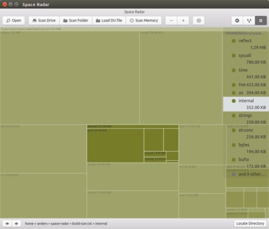

Here is a small script to measure the impact on code size by dependencies.

When running `go build -work`, the results are kept and a `WORK` is output.

Exporting this variable and running the script, will show a list of sizes.

It shows the size (in KB) of each static library built for each module.

----

```console
$ go get -work github.com/afbjorklund/build-size
WORK=/tmp/go-build396655427
$ WORK=/tmp/go-build396655427 build-size
3199	runtime
1316	reflect
780	syscall
441	time
425	fmt
394	os
259	strings
256	strconv
223	unicode
219	internal/poll
217	math
194	bytes
172	bufio
136	io
121	sync
118	sort
98	path/filepath
50	internal/fmtsort
39	internal/cpu
37	math/bits
27	github.com/afbjorklund/build-size
25	unicode/utf8
18	sync/atomic
14	internal/bytealg
14	internal/syscall/unix
13	internal/testlog
12	runtime/internal/atomic
10	runtime/internal/sys
4	errors
3	internal/race
1	runtime/internal/math
```

If building a library instead of a program, then it can be built as an `.a`.

This is done with `-buildmode=archive`, instead of using `-buildmode=exe`.

To visualize the module sizes, you can use the excellent [space-radar](https://github.com/zz85/space-radar):



Just save the output as a text file, and use the "Load DU file" button...
